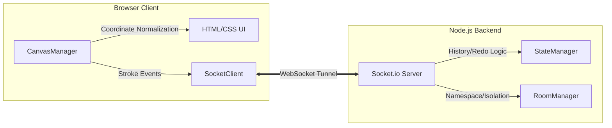

# 🏗️ CollabCanvas System Architecture

This document provides a comprehensive technical breakdown of the CollabCanvas system, focusing on its architecture, synchronization logic, and operational strategies.

---

## 1. System Overview
CollabCanvas is built on a **Client-Server-Client** broadcast model using an **Authoritative Server** for state management. This ensures that all users maintain a bit-identical representation of the drawing.

### **Component Diagram**

---

## 2. Core Strategies & Workflows

### 🔄 Undo/Redo Strategy: "Tagged History Stack"
Unlike simple drawing apps, CollabCanvas implements a **Per-User Global History**.
1.  **Tagging**: Every stroke transmitted to the server is tagged with a `userId`.
2.  **Undo Stack**: When a user clicks "Undo", the `StateManager` searches the history from the end to find the last stroke belonging to that specific `userId`.
3.  **Removal & Broadcast**: That stroke is popped from the main `strokes` array and pushed to a user-specific `undoStack`. The server then broadcasts the updated `strokes` array to all clients.
4.  **Client-Side Redraw**: Upon receiving the update, all clients perform a `ctx.clearRect()` and iterate through the new `strokes` array, recreating the canvas from scratch to ensure perfect synchronization.

### 🧹 Clear Strategy: "Full Rollback"
When a user clicks "Clear Canvas":
1.  The client emits a `clear-canvas` event.
2.  The server empties both the `strokes` array AND the `undoStack` for that room.
3.  The server broadcasts `canvas-cleared` to all participants.
4.  Clients immediately wipe their own `strokes` data and clear the canvas pixels.

### 💾 Save Strategy: "Background Flattening"
Since the canvas background is set via CSS, a standard `toDataURL()` would result in a transparent image (black lines on a invisible background). 
1.  **Off-screen Buffer**: A temporary, non-visible canvas is created in memory.
2.  **Lamination**: The temporary canvas is filled with solid white (`#ffffff`).
3.  **Context Transfer**: The current active canvas is "stamped" onto the white buffer using `drawImage()`.
4.  **Download**: The resulting base64 string is triggered as a browser download (`.png`).

---

## 3. End-to-End Process Trace (Start to Finish)

### **A Drawing Action Flow:**
1.  **Input (Client A)**: User touches the screen. `CanvasManager` captures the raw `clientX/Y`.
2.  **Normalization**: Raw coordinates are mapped against the `getBoundingClientRect()` to fit the internal **1600x900** logical plane.
3.  **Event 1 (Live Preview)**: As the user moves, `remote-draw-point` events are sent at **60fps**. Other users (Client B/C) see these points rendered immediately in a "scratchpad" mode.
4.  **Event 2 (Finalization)**: On `mouseup`, Client A packages the entire array of points into a `stroke-finalize` object.
5.  **Sequencing (Server)**: The server receives the stroke, assigns it the `userId`, and pushes it to the **History Array**. 
6.  **Broadcast**: The server sends the finalized stroke to Client B/C.
7.  **Synchronization**: Client B/C adds the stroke to their own `strokes` array and performs a final redraw to match Client A's path exactly (including curves).

---

## 4. Performance & Reliability Decisions

| Feature | Technical Implementation | Rationale |
| :--- | :--- | :--- |
| **Smoothing** | Quadratic Curve Mid-points | Prevents jagged edges; produces professional looks. |
| **Throughput** | 16ms Socket Throttling | Prevents network buffer bloat and UI "stuttering". |
| **Consistency** | Fixed 1600x900 Coordinate Plane | Essential for multi-device sync (iPhone vs 4k Desktop). |
| **Responsiveness** | Local-First Rendering | Zero-latency feedback; users don't wait for server ACK. |
| **History Limit** | 3000 Stroke Cap | Prevents server memory exhaustion during long sessions. |

---

## 5. Conflict Resolution
- **Temporal Ordering**: Conflicts are resolved by the server's arrival clock. The first packet to Reach the server becomes the "first" in history.
- **Atomic Operations**: State changes (Undo/Clear) are handled as atomic broadcasts, meaning a client never has a "partial" history state.
